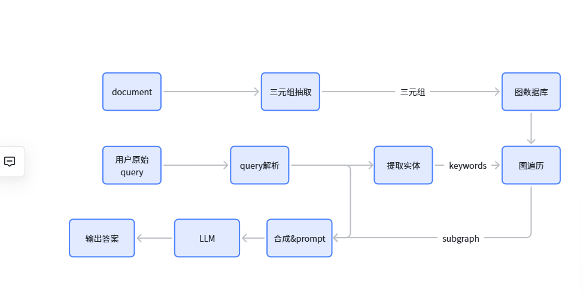
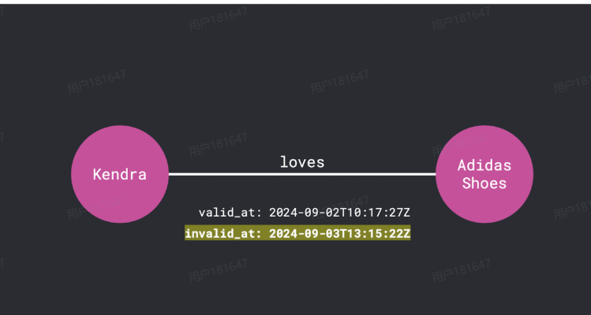
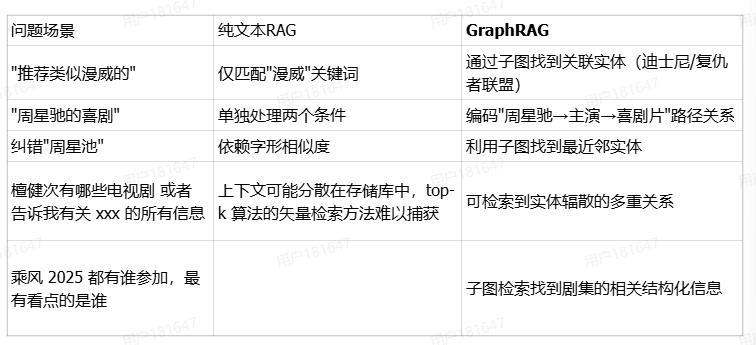

# RAG技术方案
## 方案 query解析 + graph +LLM  

实现的具体流程:


- **索引(三元组抽取)**: 通过LLM服务实现文档的三元组提取，写入图数据库。   
 
- **检索(子图召回)**: 通过LLM服务实现查询的关键词提取和泛化（大小写、别称、同义词等），并基于关键词实现子图遍历（DFS/BFS），搜索N跳以内的局部子图。  

- **生成(子图上下文)**:将局部子图数据格式化为文本，作为上下文和问题一起提交给大模型处理。  

核心：构建知识图谱
三元组关系：
- 视频 - 发布时间-最近（实体）
- 视频-演员-杨紫
- 视频 - 类别 - 喜剧 - （诙谐，好笑的）
- 视频-标签-（热血，冒险）


## 技术选型和实现
图数据库:neo4j or Tu-graph  
三元组提取：OneKE（大模型三元组抽取）:  
https://github.com/zjunlp/DeepKE/blob/main/example/llm/OneKE.md  

### prompt指令示例:
```json
{"instruction": "你是一个图谱实体知识结构化专家。根据输入实体类型(entity type)的schema描述，从文本中抽取出相应的实体实例和其属性信息，不存在的属性不输出, 属性存在多值就返回列表，并输出为可解析的json格式。", 
 "schema": [{"entity_type": "人物", "attributes": [ "中文名","英文名","祖籍","出生日期","出生地点","职业", "毕业学校", "作品","奖项"]}], 
 "input": "周杰伦（Jay Chou），1979年1月18日出生于台湾省新北市，祖籍福建省泉州市永春县，华语流行乐男歌手、音乐人、演员、导演、编剧，毕业于淡江中学。2000年，发行个人首张音乐专辑《Jay》。2001年，凭借专辑《范特西》奠定其融合中西方音乐的风格。2002年，举行“The One”世界巡回演唱会；同年，凭借歌曲《爱在西元前》获得第13届台湾金曲奖最佳作曲人奖。"
}
```

### 输出
```json
{"id": "cmpl-bac62016b7314e64b7f765debd1ec4f6","object": "text_completion","created": 1714486188,"model": "OneKE","choices": [{"index": 0,"text": "\n {\"人物\": {\"周杰伦\": {\"英文名\": \"Jay Chou\", \"出生日期\": \"1979年1月18日\", \"出生地点\": \"台湾省新北市\", \"职业\": [\"华语流行乐男歌手\", \"音乐人\", \"演员\", \"导演\", \"编剧\"], \"毕业学校\": \"淡江中学\", \"作品\": [\"Jay\", \"范特西\", \"爱在西元前\"]}, \"Jay\": {}, \"周杰伦\": {\"英文名\": \"Jay Chou\", \"出生日期\": \"1979年1月18日\", \"出生地点\": \"台湾省新北市\", \"职业\": [\"华语流行乐男歌手\", \"音乐人\", \"演员\", \"导演\", \"编剧\"], \"作品\": [\"范特西\", \"爱在西元前\"]}, \"范特西\": {}}}","logprobs": null,"finish_reason": "stop","stop_reason": null}],"usage": {"prompt_tokens": 249,"total_tokens": 439,"completion_tokens": 190}}
```

## Graphiti:   

https://github.com/getzep/graphiti
1. 实时更新知识库
通过neo4j AsyncDriver 实时接口异步更新图数据库
Graphiti 的一个关键特性是其双时间模型，该模型可以追踪事件发生的时间和被提取的时间。每个图边（或关系）都包含明确的有效性区间 (t_valid, t_invalid)。Graphiti 使用语义、关键字和图搜索来确定新知识是否与现有知识冲突。当发生冲突时，Graphiti 会智能地使用时间元数据来更新或使过时的信息失效（但不会丢弃），从而在无需大规模重新计算的情况下保持历史准确性。  



2. 成本
检索耗时成本：
P95 延迟为 300 毫秒。使用向量和 BM25 索引，不受图的大小影响，可以近乎恒定的时间访问节点和边
BFS or DFS latency (s) 2跳

常规neo4j维护成本：
存储空间估算：

| 规模类型 | 节点数 | 边数 | 存储空间 |
|----------|--------|------|----------|
| 小规模   | 10⁴    | 10⁵  | 1–5 GB   |
| 中规模   | 10⁶    | 10⁷  | 50–200 GB|
| 超大规模 | 10⁸    | 10⁹  | 5–20 TB  |

## 优势及解决的问题
### 传统方法的局限性


## 后续扩展方向
1. 跨模态graph
2. 如何融入用户画像